# 7DT Cross-Band Matching and Astrometric Validation

**Presentation manuscript — 2026-10-02**  
The numbered sections are slides. Each slide has its visible content and a spoken script. Slides 20–22 are backup tables. All angular offsets and radii are in arcseconds unless stated otherwise. The plots and counts come from `2_singphotandmatching.ipynb`, `notebook2_test.ipynb`, and their saved outputs. The five comparison plots below were redrawn from the saved catalog data using only S1, S2, and S3.

## 슬라이드 1 — Research question and workflow

### 슬라이드 내용

**How reliably can we connect detections across 20 7DT bands and then connect the resulting sources to COSMOS FINALCAT?**

```text
20 single-band catalogs (m400–m875)
  → 7DT cross-band master catalog
  → astrometric validation with 20-band sources
  → positional join with COSMOS FINALCAT
```

- Two distinct matching steps: **within 7DT** and **7DT–FINALCAT**.
- Main validation groups: **S1 clean SDSS stars**, **S2 all strict 20-band sources**, and **S3 clean SDSS galaxies**.
- Main question for the validation: how far is a band's measured position from the position predicted by the other bands?

### 슬라이드 대본

> I will explain how I matched sources across the 7DT bands. I will then test the positions of the matched sources. I use stars, all 20-band sources, and galaxies for this test. At the end, I will show the match to COSMOS FINALCAT.

## 슬라이드 2 — Input detections and adopted position errors

### 슬라이드 내용

- 20 medium bands from **m400 to m875**, in steps of 25 nm.
- Independent single-band detections and 3-arcsec aperture photometry.
- After footprint and quality selection: **78,882 band detections** enter the 7DT matching step.
- The common pixel grid has a scale of **0.505 arcsec per pixel**.
- The adopted band position errors span **0.202–0.268 arcsec**.

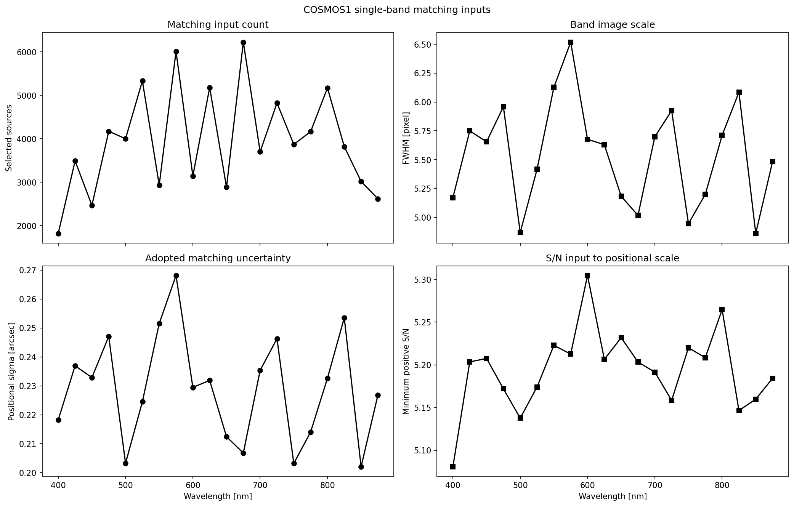

For band \(b\), the adopted positional scale is

$$
\mathrm{FWHM}_b \simeq 2\,r_{50,\mathrm{med},b},\qquad
\sigma_b = \frac{\mathrm{FWHM}_b}{2.355\,(\mathrm{S/N})_{\min,b}}.
$$

The matching code uses these \(\sigma_b\) values on the common pixel grid. The conversion to arcseconds is used for the later astrometric plots.

### 슬라이드 대본

> Each band has its own source catalog. I first select valid detections. This leaves about seventy-nine thousand band detections. I assign one position error to each band. It comes from the image width and the adopted signal-to-noise limit. The input figure shows the counts and these errors.

## 슬라이드 3 — 7DT matching: candidate search

### 슬라이드 내용

1. Start masters with the m400 detections.
2. Visit the remaining bands in wavelength order.
3. For a new detection and a current master, calculate their distance \(d_{ib}\) on the common pixel grid.
4. Keep a candidate only if its distance is below the combined three-sigma limit.

$$
\sigma_{\mathrm{comb},ib}
=\sqrt{\sigma_{\mathrm{master},i}^{,2}+\sigma_b^{,2}},
\qquad
D_{\mathrm{match},ib}
=\frac{d_{ib}}{\sigma_{\mathrm{comb},ib}},
\qquad
D_{\mathrm{match},ib}<3.
$$

**Here \(D_{\mathrm{match}}\) is the decision statistic at the time of assignment.** It uses the master's position *before* the new detection is added.

### 슬라이드 대본

> I start with the first band. Each source becomes a new master. For every later band, I search for nearby masters. I combine the error of the band and the error of the current master. I keep pairs inside three times this combined error.

## 슬라이드 4 — 7DT matching: unique assignment and master update

### 슬라이드 내용

- Assign unambiguous candidates first, ordered by \(D_{\mathrm{match}}\).
- Resolve remaining conflicts one-to-one. The code ranks ambiguous candidates by magnitude difference from an already matched, nearby-wavelength band when usable; otherwise it falls back to positional separation.
- Create a new master for each unmatched detection.
- After accepting a member, update the master position with inverse-variance weights:

$$
w_b=\frac{1}{\sigma_b^2},\qquad
x_0=\frac{\sum_{b\in M}w_bx_b}{\sum_{b\in M}w_b},\qquad
y_0=\frac{\sum_{b\in M}w_by_b}{\sum_{b\in M}w_b},
$$

$$
\sigma_0=\left(\sum_{b\in M}w_b\right)^{-1/2}.
$$

\(M\) is the set of bands already assigned to that master. This update gives higher weight to bands with smaller adopted position error.

### 슬라이드 대본

> A source can have more than one candidate. I first assign the clear pairs. I then resolve conflicts so each band source has only one master. The code also uses a nearby band magnitude when it can help. A source with no match starts a new master. After each match, I update the master position with error-based weights.

## 슬라이드 5 — Production matching result and the definition of \(R_{\rm final}\)

### 슬라이드 내용

For an accepted band member, the production consistency check compares it with the **final** weighted master:

$$
R_{\mathrm{final},b}
=\frac{\sqrt{(x_b-x_0)^2+(y_b-y_0)^2}}
{\sqrt{\sigma_b^2+\sigma_0^2}}.
$$

Here positions and errors are in pixels. **\(R_{\mathrm{final}}\) is dimensionless.** The final master includes the member being checked, so this is an *in-sample consistency diagnostic*; the independent test comes later.

| Production statistic | Result |
|:--|--:|
| Selected 7DT band detections | 78,882 |
| 7DT masters | 19,489 |
| Strict 20-band masters | 1,157 |
| Members with \(R_{\mathrm{final}}\geq3\) | 117 / 78,882 = 0.148% |
| Median \(R_{\mathrm{final}}\) | 0.364 |
| 95th / 99th percentile | 1.647 / 2.333 |
| Members with \(R_{\mathrm{final}}<3\) | 99.85% |

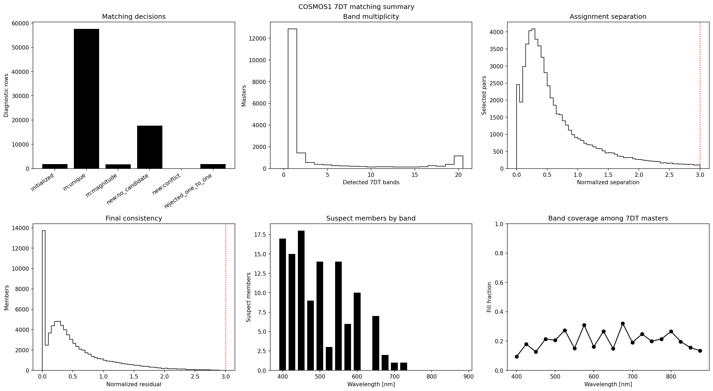

### 슬라이드 대본

> The matching produces 19,489 master sources. Of these, 1,157 have detections in all 20 bands. I compare each accepted member with its final master position. I call this value R final. It has no unit. Only 117 members are above three. This is a useful check, but the member is also part of the final master. I will use a stronger test next.

## 슬라이드 6 — Three validation samples

### 슬라이드 내용

SDSS DR17 is used **only to label star or galaxy type**. The residuals below compare **7DT positions with 7DT positions**, never 7DT with SDSS coordinates.

- Find an SDSS primary counterpart within **1.0 arcsec**.
- Require a **unique** counterpart, `clean=1`, and `mode=1` for S1 and S3.
- SDSS `type=6` defines a star; `type=3` defines a galaxy.

| Sample | Definition | Sources | Band measurements |
|:--|:--|--:|--:|
| **S1** | 20-band matched, only stars(point source) | 969 | 19,380 |
| **S2** | 20-band matched all 7DT sources | 1,157 | 23,140 |
| **S3** | 20-band matched, only galaxies(extended) | 32 | 640 |

For S1, the selection narrows from 1,157 strict 20-band sources to 1,112 with an SDSS counterpart and finite SDSS `gri` PSF photometry, then 1,073 SDSS stars, and finally 969 clean, primary, unique stars.

**S1 and S3 are subsets of S2.** Their curves are descriptive comparisons, not independent samples. S3 has only 32 sources, so its band-by-band curves are less stable.

### 슬라이드 대본

> I divide the 20-band sources into three groups. S1 contains clean SDSS stars. S2 contains all 20-band sources. S3 contains clean SDSS galaxies. I use SDSS only for the labels. The position test uses 7DT data alone. S3 is small, so I treat its trends with care.

## 슬라이드 7 — Position offsets and the leave-one-out test

### 슬라이드 내용

For the example plots, a band's offset from the full weighted master is

$$
\Delta\alpha_b^*=(\alpha_b-\alpha_0)\cos\delta_0,
\qquad
\Delta\delta_b=\delta_b-\delta_0.
$$

The calculation uses spherical coordinate offsets; this expression shows the small-angle form. Let \(\boldsymbol\theta_j\) be band \(j\)'s position on the local tangent plane. For the **independent** residual test, remove band \(b\), then predict its position from the other 19 bands:

$$
\boldsymbol\theta_{-b}
=\frac{\sum_{j\ne b}w_j\boldsymbol\theta_j}{\sum_{j\ne b}w_j},
\qquad
\sigma_{-b}=\left(\sum_{j\ne b}w_j\right)^{-1/2}.
$$

$$
R_{\mathrm{LOO},b}
=\sqrt{(\Delta\alpha_{\mathrm{LOO},b}^*)^2
+(\Delta\delta_{\mathrm{LOO},b})^2}\quad[\mathrm{arcsec}],
$$

$$
\sigma_{\mathrm{pred},b}=\sqrt{\sigma_b^2+\sigma_{-b}^2},
\qquad
D_{\mathrm{LOO},b}=\frac{R_{\mathrm{LOO},b}}{\sigma_{\mathrm{pred},b}}.
$$

**\(R_{\mathrm{LOO}}\)** is the raw angular separation. **\(D_{\mathrm{LOO}}\)** is the dimensionless separation used for the Rayleigh comparison.

### 슬라이드 대본

> First, I show the position of each band around the full master. These plots give a simple view of the scatter. For the statistical test, I leave one band out. I predict its position from the other 19 bands. R is the distance in arcseconds. D is that distance divided by the predicted error.

## 슬라이드 8 — S1: three example stars

### 슬라이드 내용

Three randomly selected S1 sources. Each plot shows the 20 band offsets in RA and Dec, colored by wavelength; the side panels show the coordinate distributions. The weighted master is at the origin.

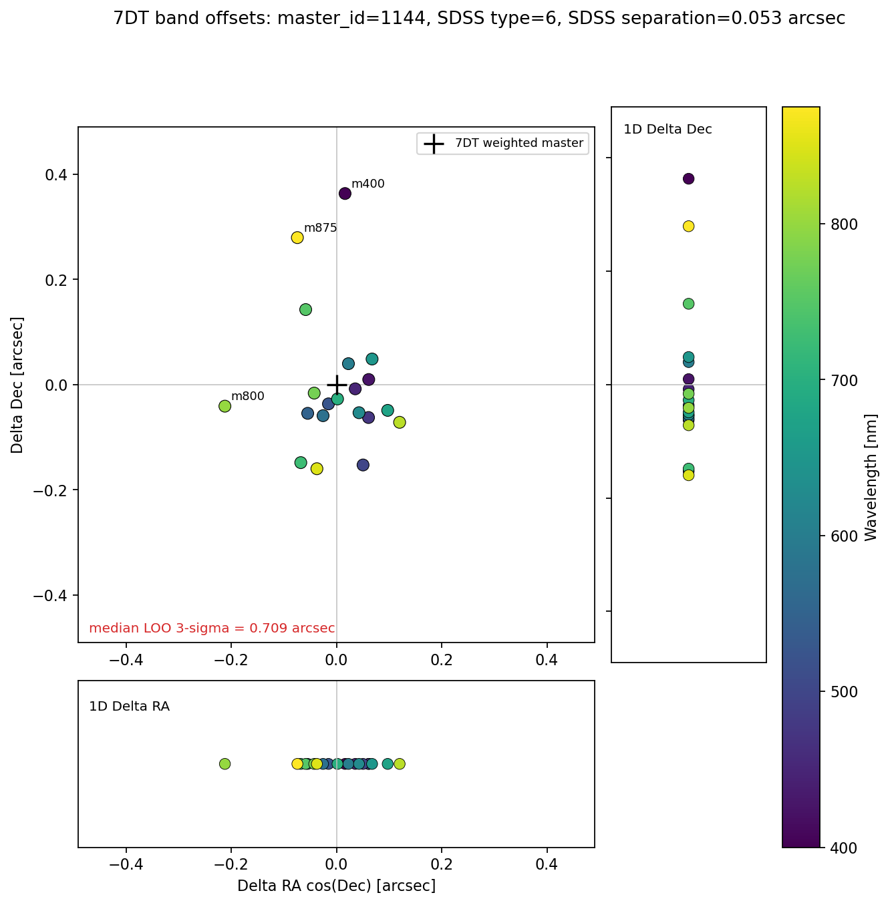

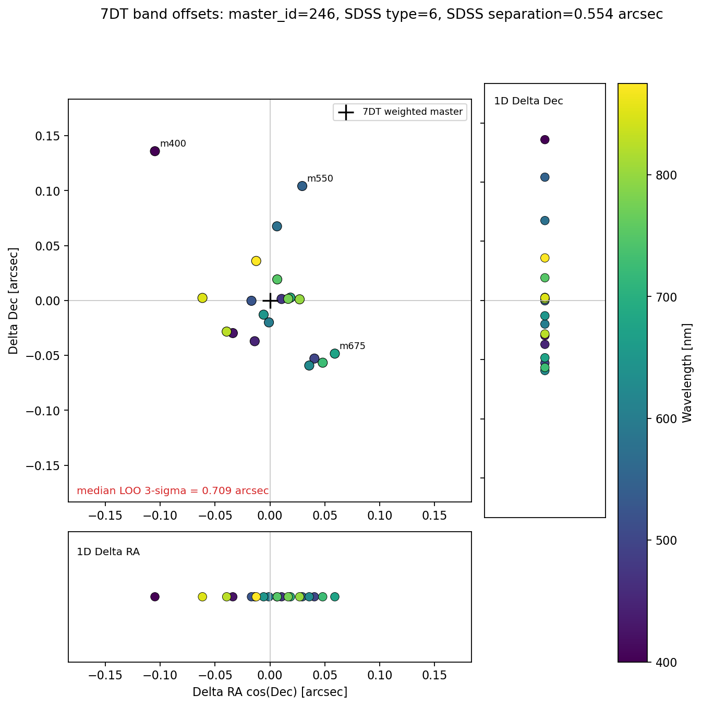

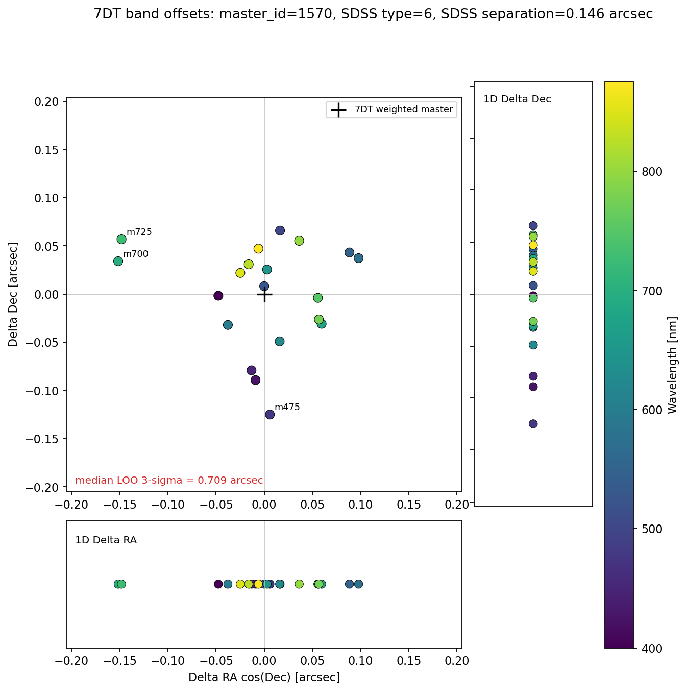

These examples show compact band positions around each master. Population conclusions come from all **969** S1 stars, not from these three examples.

### 슬라이드 대본

> These are three example stars. Each colored point is one 7DT band. The center is the weighted master position. The points stay close to the center. The examples help us see the scale of the offsets. I will use all 969 stars for the statistics.

## 슬라이드 9 — S2: three examples from the full 20-band sample

### 슬라이드 내용

Three randomly selected S2 sources, shown with the same axes and interpretation.

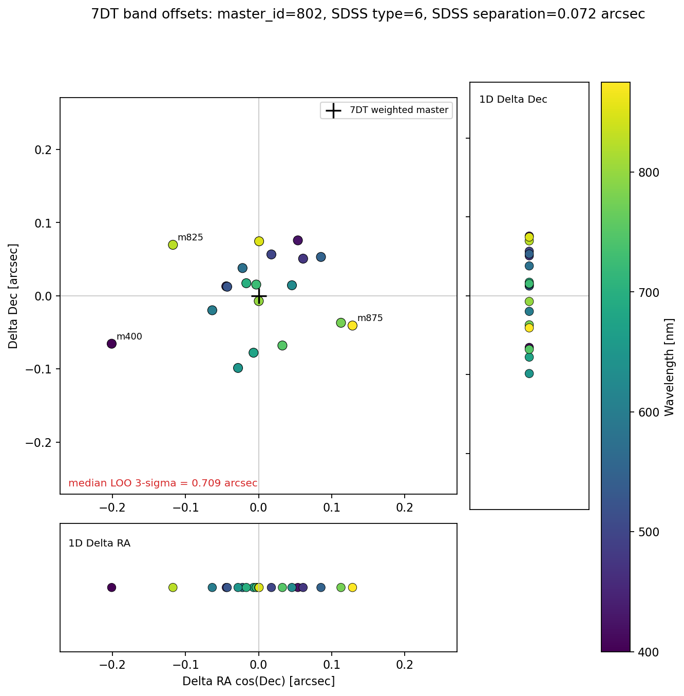

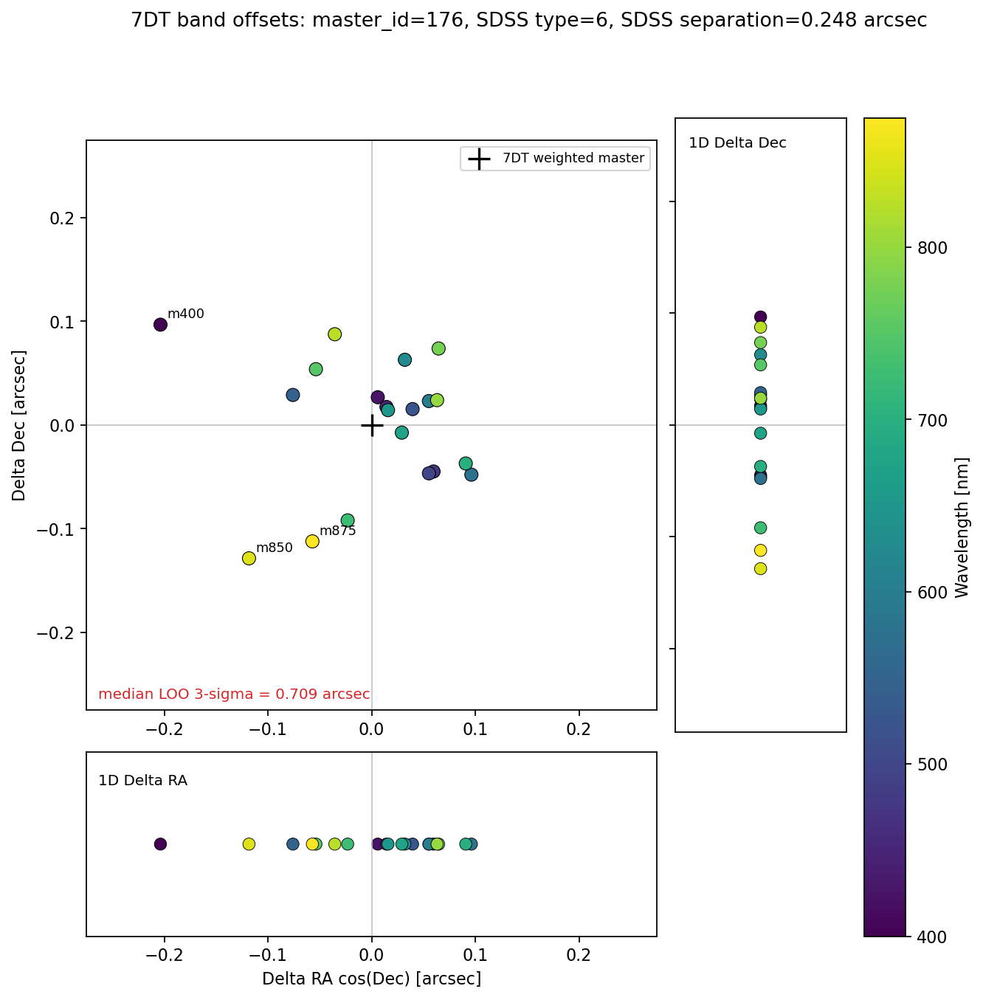

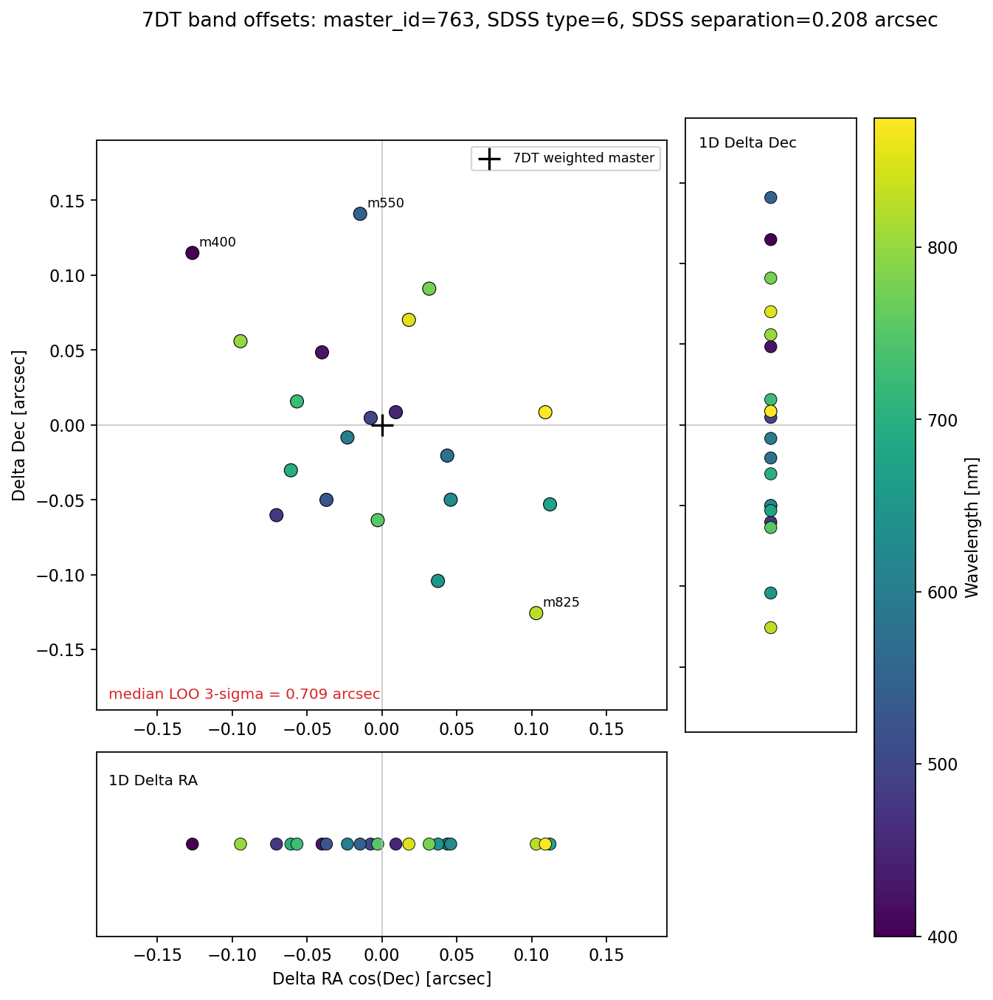

S2 includes both SDSS-labeled subsets and the remaining strict 20-band sources. These examples are illustrations; the pooled plots quantify the complete sample.

### 슬라이드 대본

> These three sources come from the full 20-band sample. We again see the position of each band around its master. This sample includes the stars and galaxies from the other groups. The three objects are only examples. The next plots use the whole sample.

## 슬라이드 10 — S3: three example galaxies

### 슬라이드 내용

Three randomly selected clean SDSS galaxies. Their band positions can be more spread out because the measured centroid of an extended source can change across bands.

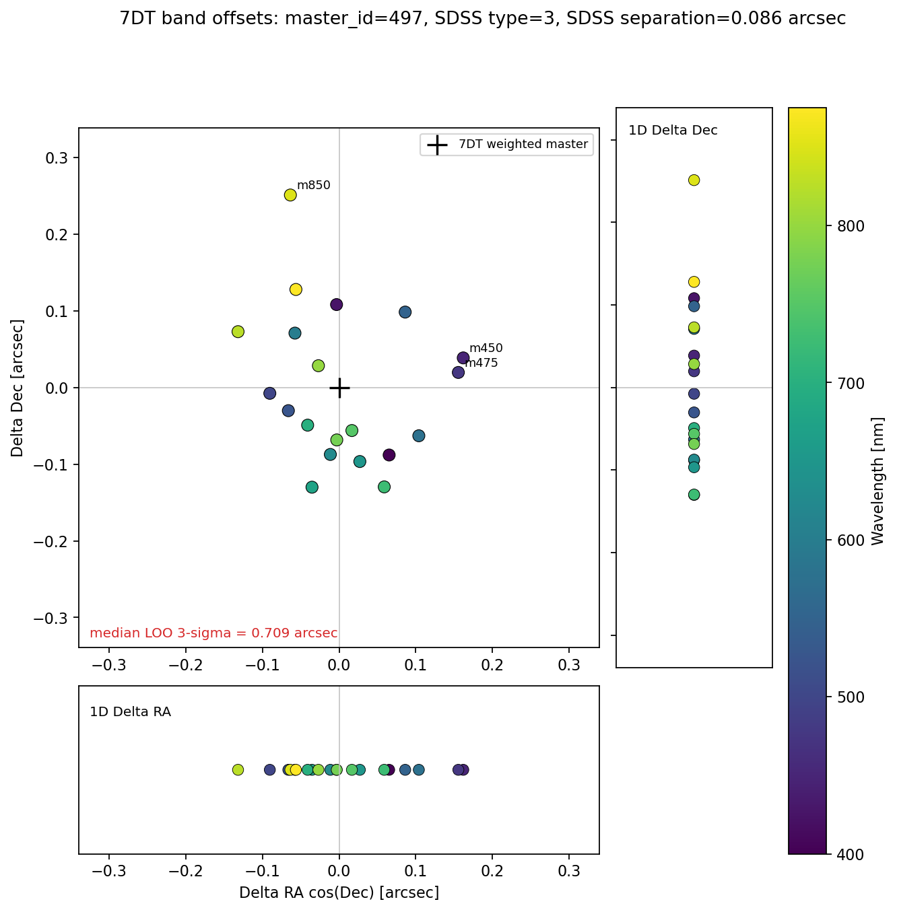

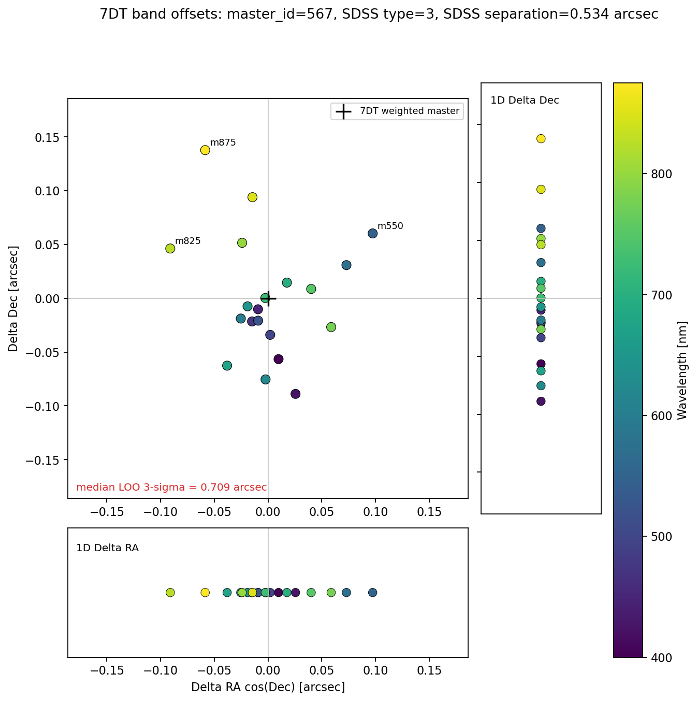

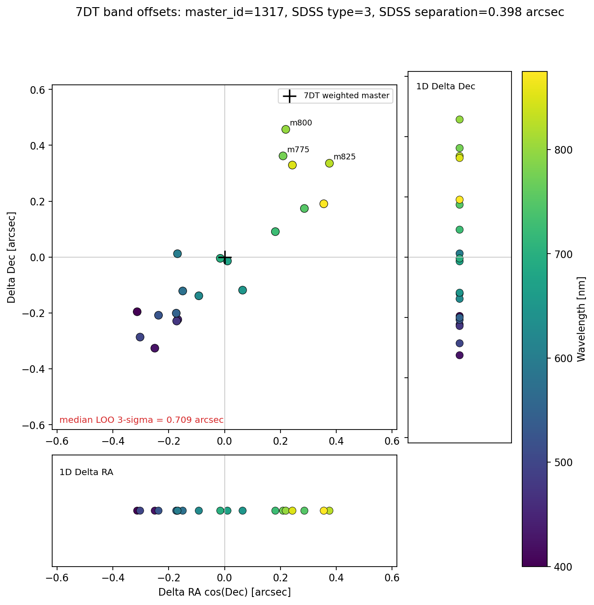

The larger offsets visible in examples, especially the last one, motivate the population comparison. They do **not** by themselves establish a physical cause; source shape and S/N can both matter.

### 슬라이드 대본

> These are three galaxies. Some points spread farther from the center. A galaxy is an extended source. Its measured center can change with band. The last example shows a clear spread. We need the full sample to compare stars and galaxies fairly.

## 슬라이드 11 — Pooled RA and Dec offsets for S1, S2, and S3

### 슬라이드 내용

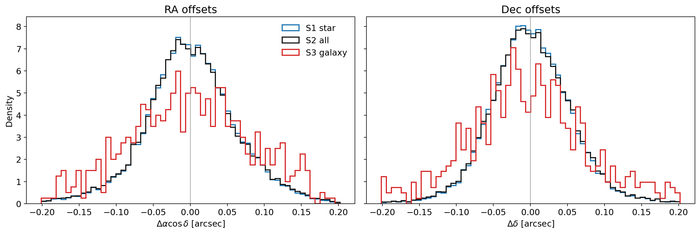

- The curves show the **density** of offsets from the full weighted 7DT master.
- S1 gives a narrow point-source reference; S2 is close because S1 makes up much of it.
- S3 has broader tails and larger scatter, consistent with less stable centroids for extended sources. Its 32-source size limits precision.
- These are **full-master offsets for visualization**, not the leave-one-out \(D_{\mathrm{LOO}}\) statistic.

### 슬라이드 대본

> Here I combine all bands in each group. The star offsets are narrow. The full sample looks similar because it contains many of these stars. The galaxy curve is broader. This is consistent with the galaxies being extended sources. The galaxy sample is small, so I do not overstate the difference.

## 슬라이드 12 — Coordinate scatter versus wavelength

### 슬라이드 내용

For coordinate offsets \(x\), define the robust scatter

$$
\operatorname{NMAD}(x)
=1.4826\,\operatorname{median}\bigl(|x-\operatorname{median}(x)|\bigr).
$$

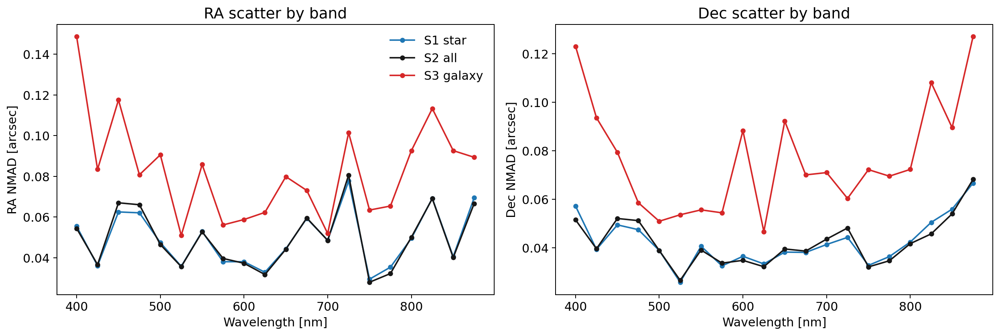

- Each point uses all sources in that group at one wavelength.
- The plot tests whether positional scatter changes from m400 to m875, separately for RA and Dec.
- S3 is generally wider and more variable than S1; with **32 galaxies**, small band-to-band changes should not be interpreted as a smooth physical trend.
- The numeric values for every band appear in slides 20–22.

### 슬라이드 대본

> This figure shows the scatter in each band. I use NMAD because it is less sensitive to large outliers. I plot RA and Dec separately. The galaxies have more scatter in many bands. Their curve also changes more from band to band. We only have 32 galaxies, so I focus on the overall pattern.

## 슬라이드 13 — S1 stars: Rayleigh expectation and observed residuals

### 슬라이드 내용

If the two independent LOO coordinate errors are isotropic Gaussians and \(\sigma_{\mathrm{pred}}\) is calibrated, the normalized radius has a **unit Rayleigh distribution**:

$$
p(D)=D\exp\!\left(-\frac{D^2}{2}\right),\quad D\geq0;
\qquad
\operatorname{median}(D)=\sqrt{2\ln2}=1.177;
\qquad
P(D<3)=1-e^{-9/2}=98.89\%.
$$

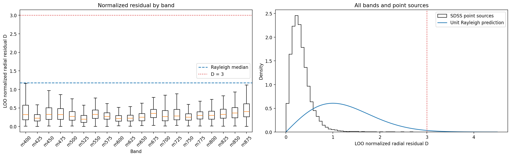

| S1 star result | Unit Rayleigh expectation | Observed S1 |
|:--|--:|--:|
| Median \(D_{\mathrm{LOO}}\) | 1.177 | **0.281** |
| Fraction \(D_{\mathrm{LOO}}<3\) | 98.89% | **99.97%** |
| Measurements | — | 19,380 from 969 stars |

**The observed distribution is far narrower than the unit Rayleigh curve.** For these bright, clean stars, the adopted positional errors appear conservative relative to the observed band-to-band scatter. This result alone cannot identify which part of the error model causes the difference.

### 슬라이드 대본

> Stars should be a clean test of position errors. If our error scale is correct, D should follow the Rayleigh curve. Its median should be about 1.18. The observed median is only 0.28. The histogram is much narrower than expected. This suggests that our adopted errors are large for these stars. It does not tell us which assumption needs to change.

## 슬라이드 14 — Normalized LOO residuals in all three samples

### 슬라이드 내용

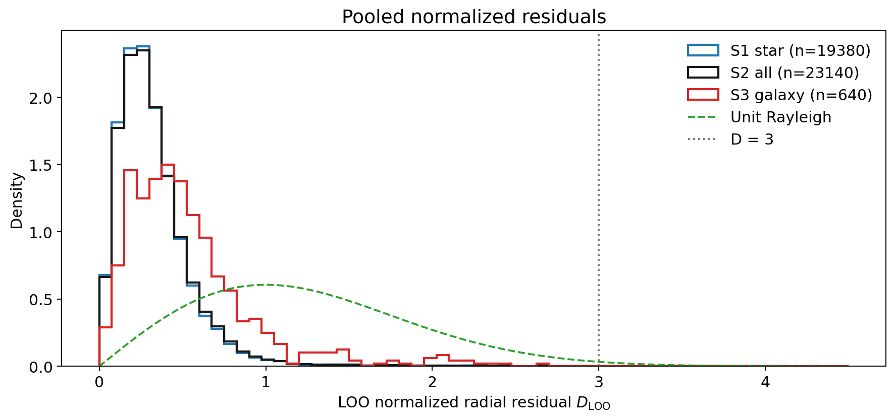

| Sample | Sources | Band residuals | Median \(D_{\mathrm{LOO}}\) | Fraction \(D_{\mathrm{LOO}}<3\) |
|:--|--:|--:|--:|--:|
| S1 stars | 969 | 19,380 | **0.281** | 99.97% |
| S2 all | 1,157 | 23,140 | **0.286** | 99.98% |
| S3 galaxies | 32 | 640 | **0.451** | 100.00% |

- All three observed distributions peak well below the unit Rayleigh expectation.
- S3 has a larger median \(D_{\mathrm{LOO}}\) than S1, consistent with broader centroid scatter. The 100% value for S3 is based on only **640 band residuals from 32 galaxies**; it does not establish a zero-tail population.
- The star distribution is the primary error-model diagnostic because it has a larger, cleaner point-source sample.

### 슬라이드 대본

> I now compare the three groups. The star median is 0.28. The full sample is almost the same. The galaxy median is higher, at 0.45. All three values are below the Rayleigh median of 1.18. The galaxy group has only 32 objects. I use the stars as the main test of the error model.

## 슬라이드 15 — Median normalized residual versus wavelength

### 슬라이드 내용

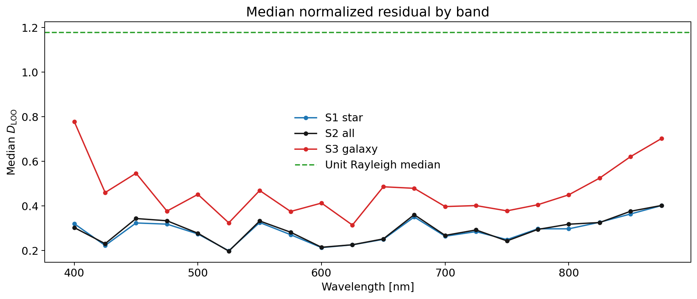

- The dashed line is the **unit Rayleigh median, 1.177**.
- Every plotted band median for S1, S2, and S3 is below this reference line.
- S1 and S2 track each other closely because the samples overlap strongly.
- S3 tends to be higher, but individual band differences are uncertain with only 32 galaxies.
- This is a **normalized** statistic. Changes can reflect measured scatter, the adopted band error \(\sigma_b\), or both.

### 슬라이드 대본

> This plot shows one median D value for each band. The dashed line is the Rayleigh value. Every band lies below it. The star and full-sample curves are close. The galaxy values are often higher. We should not read a detailed wavelength trend from only 32 galaxies.

## 슬라이드 16 — Signal-to-noise and the raw positional radius

### 슬라이드 내용

**This plot uses raw \(R_{\mathrm{LOO}}\) in arcseconds, not normalized \(D_{\mathrm{LOO}}\).** The black points and line summarize the median in S/N bins; the shaded band spans the 16th–84th percentiles.

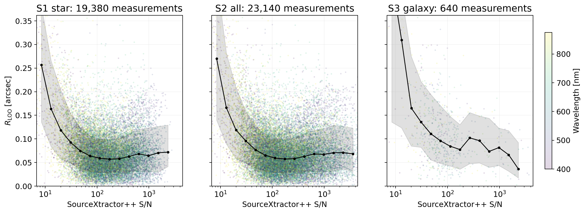

| Sample | Median SourceXtractor++ S/N | Median \(R_{\mathrm{LOO}}\) |
|:--|--:|--:|
| S1 stars | 135.1 | **0.0658″** |
| S2 all | 153.2 | **0.0669″** |
| S3 galaxies | 67.3 | **0.1059″** |

The plot shows larger raw separations at lower S/N and a broad flattening at high S/N for S1 and S2. The galaxy radius is larger on average. The higher S1/S2 S/N and the small S3 size mean this figure alone cannot isolate source extension as the cause.

### 슬라이드 대본

> Here I use the actual position distance in arcseconds. Low signal-to-noise points often have larger distances. At high signal-to-noise, the star and full-sample curves become flatter. The median star distance is about 0.066 arcseconds. The galaxy median is about 0.106 arcseconds. The galaxies also have lower signal-to-noise, so we cannot assign the full difference to source shape.

## 슬라이드 17 — Joining 7DT masters to COSMOS FINALCAT

### 슬라이드 내용

- Match **19,489 7DT masters** against **58,747 FINALCAT sources** inside the valid footprint (of 126,280 FINALCAT entries in total).
- Find angular-separation candidates inside a trial radius \(r\). Sort by separation and assign pairs **one-to-one**.
- Estimate chance associations with **eight shifted FINALCAT realizations**, using 10- or 20-arcsec shifts.

$$
\rho_{ij}=\operatorname{angsep}
\bigl((\alpha_i,\delta_i)_{\rm 7DT},
(\alpha_j,\delta_j)_{\rm FINALCAT}\bigr),
\qquad \rho_{ij}<r.
$$

| Trial radius | Actual one-to-one matches | Shifted-match mean ± SD | Shifted / actual |
|--:|--:|--:|--:|
| 0.5″ | 2,682 | 55.8 ± 5.2 | 2.08% |
| **0.7″** | **2,977** | **107.9 ± 7.2** | **3.62%** |
| 1.0″ | 3,212 | 211.4 ± 16.9 | 6.58% |

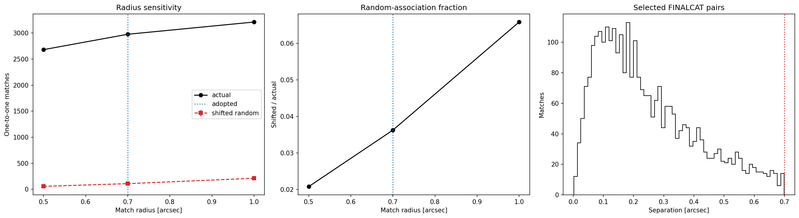

**Adopted radius: 0.7″.** The shifted/actual ratio is a diagnostic of chance-match pressure, not a calibrated probability that a particular selected pair is false.

### 슬라이드 대본

> I tested several search radii. To estimate chance matches, I shifted the FINALCAT positions in eight directions. I used shifts of ten and twenty arcseconds, to the east, west, north, and south. These shifts break the real source pairs but keep the source density nearly the same. I ran the same matching method on each shifted catalog.
>
> The results show a trade-off. A larger radius finds more matches, but it also accepts more chance matches. At one arcsecond, the random-match ratio becomes too high. At 0.7 arcseconds, I still recover many counterparts while keeping the random-match ratio lower. I therefore chose 0.7 arcseconds as the sweet spot.
>
> The shifted results estimate the overall chance-match level. They do not give the false-match probability for each individual source.

## 슬라이드 18 — FINALCAT match quality and union catalog

### 슬라이드 내용

For the **2,977 selected counterparts** at 0.7″, the angular separation has a **0.205″ median** and a **0.578″ 95th percentile**.

| Final master class | Count |
|:--|--:|
| 7DT + FINALCAT matched | **2,977** |
| 7DT only | 16,512 |
| FINALCAT only, within valid footprint | 55,770 |
| **Union catalog** | **75,259** |

$$
N_{\mathrm{union}}=N_{\rm 7DT}+N_{\rm FINALCAT,valid}-N_{\rm matched}
=19{,}489+58{,}747-2{,}977=75{,}259.
$$

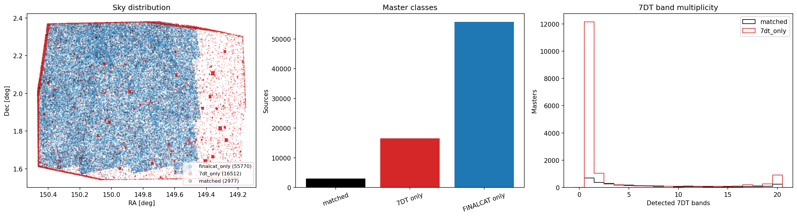

### 슬라이드 대본

> The selected counterpart pairs are close on the sky. Their median separation is 0.205 arcseconds. The matched group has 2,977 sources. There are also 7DT-only and FINALCAT-only sources. Together, they make a union catalog of 75,259 sources.

## 슬라이드 19 — Main findings and next checks

### 슬라이드 내용

1. **7DT matching:** an uncertainty-scaled, one-to-one match across 20 bands creates **19,489 masters**, including **1,157 strict 20-band sources**.
2. **Astrometric consistency:** clean stars have \(\operatorname{median}(D_{\mathrm{LOO}})=0.281\), far below the **1.177** unit Rayleigh expectation. The adopted error model appears conservative for this sample.
3. **Source morphology:** the clean galaxy sample has broader raw and normalized residuals than the star sample, but contains only **32 galaxies** and has lower S/N.
4. **FINALCAT join:** the shifted-position check supports **0.7″**, giving **2,977 counterpart pairs** and a **75,259-source union**.

**Next checks:** test the FWHM-to-position-error scaling, correlated astrometric terms and a possible position-error floor; increase the clean galaxy sample before interpreting wavelength structure.

### 슬라이드 대본

> The 20-band match gives a large 7DT master catalog. The star positions agree more closely than our error model predicts. Galaxies show broader offsets, but the galaxy sample is small and has lower signal-to-noise. The FINALCAT join uses a tested radius of 0.7 arcseconds. My next step is to improve the position-error model and repeat the galaxy test with more sources.

## 슬라이드 20 — Backup table: S1 clean stars by band

### 슬라이드 내용

These are the 20-band statistics for **969 S1 stars**. RA/Dec NMAD and median radial distance describe offsets from the **full** master. Median \(D_{\mathrm{LOO}}\) comes from the independent leave-one-out calculation. NMAD and full-master radial distance are in arcseconds.

| Band (nm) | n | RA NMAD (″) | Dec NMAD (″) | Median full-master radius (″) | Median D_LOO | D_LOO < 3 |
|:--|--:|--:|--:|--:|--:|--:|
| m400 (400) | 969 | 0.0554 | 0.0572 | 0.0680 | 0.3202 | 99.59% |
| m425 (425) | 969 | 0.0361 | 0.0394 | 0.0515 | 0.2224 | 99.90% |
| m450 (450) | 969 | 0.0625 | 0.0495 | 0.0735 | 0.3234 | 100.00% |
| m475 (475) | 969 | 0.0621 | 0.0475 | 0.0769 | 0.3181 | 100.00% |
| m500 (500) | 969 | 0.0474 | 0.0389 | 0.0539 | 0.2741 | 100.00% |
| m525 (525) | 969 | 0.0358 | 0.0259 | 0.0434 | 0.1986 | 100.00% |
| m550 (550) | 969 | 0.0529 | 0.0407 | 0.0802 | 0.3255 | 100.00% |
| m575 (575) | 969 | 0.0380 | 0.0326 | 0.0713 | 0.2708 | 100.00% |
| m600 (600) | 969 | 0.0380 | 0.0366 | 0.0477 | 0.2129 | 100.00% |
| m625 (625) | 969 | 0.0329 | 0.0334 | 0.0510 | 0.2254 | 100.00% |
| m650 (650) | 969 | 0.0443 | 0.0383 | 0.0516 | 0.2499 | 100.00% |
| m675 (675) | 969 | 0.0593 | 0.0382 | 0.0702 | 0.3502 | 100.00% |
| m700 (700) | 969 | 0.0485 | 0.0414 | 0.0606 | 0.2639 | 100.00% |
| m725 (725) | 969 | 0.0777 | 0.0443 | 0.0686 | 0.2846 | 100.00% |
| m750 (750) | 969 | 0.0295 | 0.0328 | 0.0489 | 0.2486 | 100.00% |
| m775 (775) | 969 | 0.0354 | 0.0364 | 0.0618 | 0.2973 | 100.00% |
| m800 (800) | 969 | 0.0495 | 0.0424 | 0.0674 | 0.2971 | 100.00% |
| m825 (825) | 969 | 0.0692 | 0.0505 | 0.0811 | 0.3267 | 100.00% |
| m850 (850) | 969 | 0.0405 | 0.0560 | 0.0711 | 0.3637 | 100.00% |
| m875 (875) | 969 | 0.0694 | 0.0667 | 0.0887 | 0.4014 | 100.00% |

### 슬라이드 대본

> This table gives the values behind the star curves. It lists every 7DT band. The RA and Dec columns show the scatter. The radial column shows distance from the full master. The D column uses the leave-one-out test. I use this table if we need to inspect one band in detail.

## 슬라이드 21 — Backup table: S2 all strict 20-band sources

### 슬라이드 내용

The same statistics for **1,157 S2 sources**. S2 contains S1 and S3, so its numbers should not be treated as an independent replication of either subset.

| Band (nm) | n | RA NMAD (″) | Dec NMAD (″) | Median full-master radius (″) | Median D_LOO | D_LOO < 3 |
|:--|--:|--:|--:|--:|--:|--:|
| m400 (400) | 1,157 | 0.0544 | 0.0516 | 0.0643 | 0.3027 | 99.65% |
| m425 (425) | 1,157 | 0.0366 | 0.0396 | 0.0533 | 0.2305 | 99.91% |
| m450 (450) | 1,157 | 0.0670 | 0.0521 | 0.0780 | 0.3433 | 100.00% |
| m475 (475) | 1,157 | 0.0660 | 0.0512 | 0.0806 | 0.3333 | 100.00% |
| m500 (500) | 1,157 | 0.0465 | 0.0390 | 0.0546 | 0.2774 | 100.00% |
| m525 (525) | 1,157 | 0.0356 | 0.0266 | 0.0431 | 0.1970 | 100.00% |
| m550 (550) | 1,157 | 0.0527 | 0.0391 | 0.0819 | 0.3324 | 100.00% |
| m575 (575) | 1,157 | 0.0396 | 0.0337 | 0.0742 | 0.2819 | 100.00% |
| m600 (600) | 1,157 | 0.0373 | 0.0349 | 0.0480 | 0.2144 | 100.00% |
| m625 (625) | 1,157 | 0.0317 | 0.0323 | 0.0510 | 0.2256 | 100.00% |
| m650 (650) | 1,157 | 0.0442 | 0.0396 | 0.0520 | 0.2519 | 100.00% |
| m675 (675) | 1,157 | 0.0595 | 0.0387 | 0.0723 | 0.3605 | 100.00% |
| m700 (700) | 1,157 | 0.0485 | 0.0436 | 0.0615 | 0.2677 | 100.00% |
| m725 (725) | 1,157 | 0.0806 | 0.0482 | 0.0704 | 0.2920 | 100.00% |
| m750 (750) | 1,157 | 0.0280 | 0.0322 | 0.0478 | 0.2429 | 100.00% |
| m775 (775) | 1,157 | 0.0322 | 0.0347 | 0.0612 | 0.2945 | 100.00% |
| m800 (800) | 1,157 | 0.0501 | 0.0418 | 0.0722 | 0.3179 | 100.00% |
| m825 (825) | 1,157 | 0.0690 | 0.0458 | 0.0808 | 0.3253 | 100.00% |
| m850 (850) | 1,157 | 0.0401 | 0.0540 | 0.0735 | 0.3759 | 100.00% |
| m875 (875) | 1,157 | 0.0666 | 0.0682 | 0.0888 | 0.4018 | 100.00% |

### 슬라이드 대본

> This table gives the values for all strict 20-band sources. It has the same columns as the star table. This group includes both stars and galaxies. Its median values are close to the star sample because the groups overlap strongly.

## 슬라이드 22 — Backup table: S3 clean galaxies by band

### 슬라이드 내용

The same statistics for **32 S3 galaxies**. Each row has only 32 sources; use these numbers as descriptive measurements rather than a precise wavelength trend.

| Band (nm) | n | RA NMAD (″) | Dec NMAD (″) | Median full-master radius (″) | Median D_LOO | D_LOO < 3 |
|:--|--:|--:|--:|--:|--:|--:|
| m400 (400) | 32 | 0.1486 | 0.1230 | 0.1653 | 0.7785 | 100.00% |
| m425 (425) | 32 | 0.0834 | 0.0936 | 0.1064 | 0.4598 | 100.00% |
| m450 (450) | 32 | 0.1175 | 0.0794 | 0.1242 | 0.5464 | 100.00% |
| m475 (475) | 32 | 0.0807 | 0.0586 | 0.0911 | 0.3766 | 100.00% |
| m500 (500) | 32 | 0.0906 | 0.0510 | 0.0889 | 0.4516 | 100.00% |
| m525 (525) | 32 | 0.0510 | 0.0537 | 0.0708 | 0.3239 | 100.00% |
| m550 (550) | 32 | 0.0858 | 0.0557 | 0.1156 | 0.4690 | 100.00% |
| m575 (575) | 32 | 0.0561 | 0.0545 | 0.0987 | 0.3749 | 100.00% |
| m600 (600) | 32 | 0.0588 | 0.0883 | 0.0924 | 0.4127 | 100.00% |
| m625 (625) | 32 | 0.0623 | 0.0467 | 0.0710 | 0.3140 | 100.00% |
| m650 (650) | 32 | 0.0798 | 0.0922 | 0.1002 | 0.4857 | 100.00% |
| m675 (675) | 32 | 0.0730 | 0.0701 | 0.0960 | 0.4788 | 100.00% |
| m700 (700) | 32 | 0.0519 | 0.0710 | 0.0912 | 0.3969 | 100.00% |
| m725 (725) | 32 | 0.1014 | 0.0604 | 0.0967 | 0.4014 | 100.00% |
| m750 (750) | 32 | 0.0634 | 0.0722 | 0.0743 | 0.3777 | 100.00% |
| m775 (775) | 32 | 0.0654 | 0.0695 | 0.0843 | 0.4053 | 100.00% |
| m800 (800) | 32 | 0.0926 | 0.0723 | 0.1021 | 0.4497 | 100.00% |
| m825 (825) | 32 | 0.1133 | 0.1080 | 0.1304 | 0.5248 | 100.00% |
| m850 (850) | 32 | 0.0926 | 0.0895 | 0.1214 | 0.6210 | 100.00% |
| m875 (875) | 32 | 0.0893 | 0.1270 | 0.1552 | 0.7021 | 100.00% |

### 슬라이드 대본

> This table gives the values for the clean galaxies. Each band has 32 measurements. The scatter and distance values are often larger than in the star table. The sample is small. I would need more galaxies to test detailed trends.
